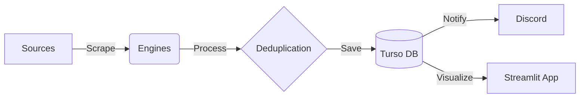

# 🦅 News-Fetcher: The Hunt

[](https://www.python.org/)
[](https://streamlit.io/)
[](https://turso.tech/)
[](https://infisical.com/)

> **"Built for the Alpha Hunter."**

**News-Fetcher** is a professional-grade market intelligence tool designed to scrape, aggregate, and analyze financial news from multiple sources. It automates the tedious process of gathering market data, allowing you to focus on analysis and execution.

Whether you are tracking **Macroeconomic indicators**, **Stock catalysts**, or **Company-specific news**, the Grandmaster Hunt protocol covers it all.

---

## ✨ Key Features

### 🔍 Grandmaster Hunt Protocol
Our proprietary scanning engine executes a three-pronged attack on the market:

1.  **🌍 Macro Scan**: Fetches critical global data including FED updates, Economic Indicators (CPI, PPI), Treasury yields, Commodities, Geopolitics, and Crypto.
2.  **📈 Stocks Scan**: Monitors broad market movers, Earnings reports, Analyst ratings, M&A activity, IPOs, and Insider trading.
3.  **🏢 Company Scan**: Deep dives into your specific watchlist using **MarketAux** API and Google News fallbacks to ensure no headline is missed.

### 🤖 Automated Intelligence
-   **Daily Cron Jobs**: Fully automated daily scans ensure your database is always fresh.
-   **Discord Alerts**: Get rich, real-time summaries delivered straight to your Discord server.
-   **Smart Dedup**: Intelligent deduplication logic prevents noise and ensures you only see new information.

### 🎮 Mission Control (Dashboard)
A powerful **Streamlit** dashboard gives you full command:
-   **Live Feed**: Real-time view of incoming news.
-   **Manual Hunt**: Trigger scans on-demand for specific sectors or tickers.
-   **Calendar Sync**: Automatically syncs Economic and Earnings calendars.
-   **AI Export**: One-click export of news data formatted for LLM analysis.

### 🔒 Enterprise-Grade Infrastructure
-   **Turso (LibSQL)**: Edge-based SQLite database for lightning-fast reads and writes.
-   **Infisical**: Zero-trust secret management. No API keys are stored in the code.
-   **Selenium & Soup**: robust scraping using a hybrid of `requests` and `selenium` to handle dynamic content.

---

## 🚀 Getting Started

### Prerequisites
-   **Python 3.9+**
-   **Google Chrome** (for Selenium scraping)

### Installation

1.  **Clone the Repository**
    ```bash
    git clone https://github.com/yourusername/news-fetcher.git
    cd news-fetcher
    ```

2.  **Set up Virtual Environment**
    ```bash
    python3 -m venv .venv
    source .venv/bin/activate
    ```

3.  **Install Dependencies**
    ```bash
    pip install -r requirements.txt
    ```

### Configuration (Infisical)
This project uses **Infisical** to manage secrets securely. You will need to create a `.env` file with your Infisical Machine Identity credentials:

```env
INFISICAL_CLIENT_ID="your_client_id"
INFISICAL_CLIENT_SECRET="your_client_secret"
INFISICAL_PROJECT_ID="your_project_id"
```

Ensure your Infisical project has the following secrets defined:
-   `TURSO_DB_URL`: Your Turso Database URL.
-   `TURSO_DB_AUTH_TOKEN`: Your Turso Auth Token.
-   `MARKETAUX_API_KEY`: Your MarketAux API Key.
-   `DISCORD_WEBHOOK_URL`: Webhook URL for Discord notifications.

---

## 🖥️ Usage

### 🦅 Automated Hunt (CLI)
Run the daily scan manually or schedule it via cron:
```bash
python main.py
```
This will:
1.  Sync the Economic Calendar.
2.  Run the Macro, Stocks, and Company scans.
3.  Save results to the Turso DB.
4.  Send a summary report to Discord.

### 📊 Mission Control (Dashboard)
Launch the interactive dashboard:
```bash
streamlit run streamlit_app.py
```
From here you can:
-   View the latest news feed.
-   Manually trigger specific hunts.
-   Check system logs and heartbeat status.
-   Export data for AI analysis.

---

## 🛠️ Architecture

The system follows a linear pipeline:



1.  **Sources**: Yahoo Finance, Google News, MarketAux.
2.  **Engines**: Specialized Python modules (`macro_engine`, `stocks_engine`, etc.) fetch the data.
3.  **Deduplication**: Checks against the database to ensure uniqueness.
4.  **Storage**: Data is persisted in a Turso (LibSQL) database.
5.  **Output**: Alerts are sent to Discord, and data is visualized in the Dashboard.

---

## 🤝 Contributing

We welcome contributions! Please see our [Contributing Guide](CONTRIBUTING.md) for details on how to submit pull requests, report bugs, and suggest features.

Please note that this project is released with a [Contributor Code of Conduct](CODE_OF_CONDUCT.md). By participating in this project you agree to abide by its terms.

---

*Happy Hunting!* 🦅
